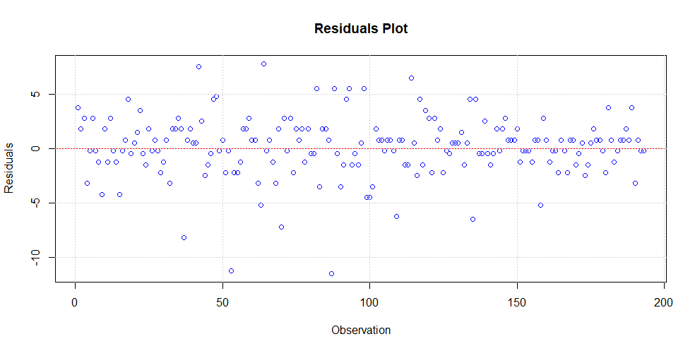

# Technical Resource Allocation in Unity: Optimizing Frame Rates and Player Experience

### Details of variables used
Name | Variable | Type | Value
---  | ---      | ---  | ---
Levels | `LEVEL` | Continuous (Integer) | $[1,27]$
Actual Audio | `AA` | Categorical (Ordinal) | $[1,3]$
Actual Graphics | `AG` | Categorical (Ordinal) | $[1,3]$
Actual Physics | `AP` | Categorical (Ordinal) | $[1,3]$
Audio Rating | `AR` | Categorical (Ordinal) | $[1,5]$
Graphics Rating | `GR` | Categorical (Ordinal) | $[1,5]$
Physics Rating | `PR` | Categorical (Ordinal) | $[1,5]$
Enjoyment Rating | `ER` | Categorical (Ordinal) | $[1,5]$
Comfort Rating | `CR` | Categorical (Ordinal) | $[1,5]$
Overall Satisfaction Rating | `OR` | Continuous (Integer) | $[1,5]$
Score | `SCORE` | Continuous (Integer) | $[0,1000]$
Average FPS| `AVGFPS` | Continuous (Integer) | $[30,60]$
Gaming Interest and Experience Rating | `GAMING` | Categorical (Ordinal) | $[1,5]$
Participant Number | `PCP` | Continuous (Integer) | $[1,24]$
Player Experience (weighted sum of all `_R`) | `PE` | Continuous (Decimal) | $[1,5]$
Normalized data of `AA, AG, AP, AVGFPS, PE` | `NAA`, `NAG`, `NAP`, `NAVGFPS`, `NPE` | Continuous (Decimal) | $[0,1]$
Normalized data of $0.5AVGFPS+0.5PE$ | `NAVGFPSPE` | Continuous (Decimal) | $[0,1]$

### Primary Research Questions
1. Which of the technical variables (`AA`/`AG`/`AP`) have the most influence on AVGFPS?
2. Which of the technical variables (`AA`/`AG`/`AP`) have the most influence on PE?
3. What is the optimal combination of the technical variables (`AA`/`AG`/`AP`) to achieve optimal `NAVGFPSPE`?

### Secondary Research Questions
4. Which technical variables (`AA`/`AG`/`AP`) settings do most participants prefer?
5. Does Score (`SCORE`) depend on Comfort (`CR`)?
6. Does Gaming Interest and Experience Rating (`GAMING`) truly reflect on the variability in all the rating variables (`AR`, `GR`, `PR`, `ER`, `CR`, `OR`)?  

#
#### Notes:
- none

#
## **Findings**

In order to address the research questions, I developed models tailored to each question. 
Provided below are the evaluation of these models along with the model descriptions.

**Q1. Which of the technical variables (`AA`/`AG`/`AP`) have the most influence on `AVGFPS`?**

| Method | Value |
| :---: | :---: |
| RMSE | $2.769354$ |
| R-squared | $0.758044$ |
| Cross-validated RMSE | $1.777068, 1.763340, 2.257344$ |

**Table 1** Model Assessment

| Variable | Importance | % |
| :---: | :---: | :---: |
| `AG` | $0.6931757927$ | $99.74$ |
| `AP` | $0.0012707157$ | $0.18$ |
| `AA` | $0.0005060404$ | $0.07$ |

**Table 2** Outcome

**Conclusion:** 

Graphics `AG`: $0.6931757927$

This VarImp value indicates that Graphics has the highest importance among the three feature variables in predicting FPS. A VarImp value close to 1 suggests that changes in the Graphics feature have a significant impact on FPS predictions. Therefore, Graphics is considered the most influential variable in Model 1 for predicting FPS.

Physics `AP`: $0.0012707157$

The VarImp value for Physics is much lower compared to Graphics, indicating that Physics has much less influence on FPS predictions. A VarImp value close to 0 suggests that changes in the Physics feature have minimal impact on FPS predictions in comparison to Graphics.

Audio `AA`: $0.0005060404$

Similarly, the VarImp value for Audio is also quite low compared to Graphics. This suggests that Audio has less influence on FPS predictions compared to Graphics and even less than Physics. 

Based on these VarImp values, we can conclude that Graphics (`AG`) is the most influential variable on `AVGFPS`, followed by Physics (`AP`) and then Audio (`AA`).

**Q2. Which of the technical variables (`AA`/`AG`/`AP`) have the most influence on `PE`?**

Model: 

| Method | Value |
| :---: | :---: |
| RMSE | $0.9346277$ |
| R-squared | $-0.06896572$ | 
| Cross-validated RMSE | $0.9475976, 0.9475561, 0.9492149$ |

|Method | Value |
| :---: | :---: |
|RMSE | $0.1761723$ |
|R-squared | $0.2455282$ |
|Cross-validated RMSE | $0.4121428, 0.4135205, 0.4293897$ |
