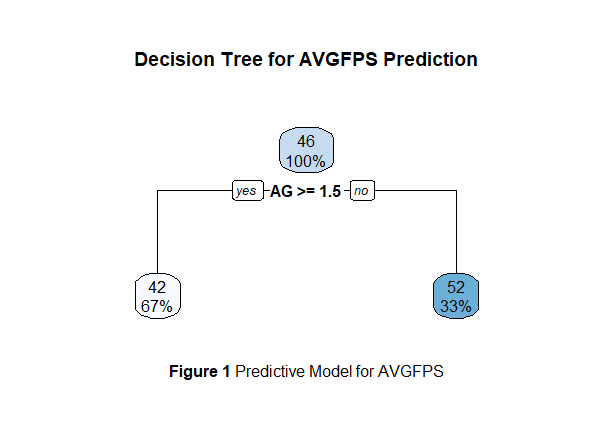
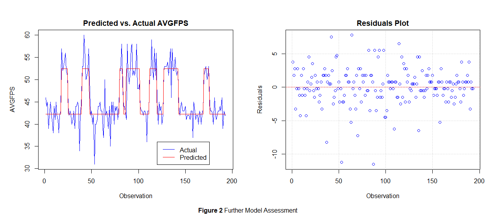
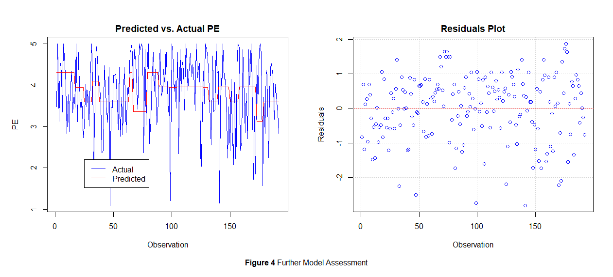

# Technical Resource Allocation in Unity: Optimizing Frame Rates and Player Experience

### Details of variables used
Name | Variable | Type | Value
---  | ---      | ---  | ---
Levels | `LEVEL` | Continuous (Integer) | $[1,27]$
Actual Audio | `AA` | Categorical (Ordinal) | $[1,3]$
Actual Graphics | `AG` | Categorical (Ordinal) | $[1,3]$
Actual Physics | `AP` | Categorical (Ordinal) | $[1,3]$
Audio Rating | `AR` | Categorical (Ordinal) | $[1,5]$
Graphics Rating | `GR` | Categorical (Ordinal) | $[1,5]$
Physics Rating | `PR` | Categorical (Ordinal) | $[1,5]$
Enjoyment Rating | `ER` | Categorical (Ordinal) | $[1,5]$
Comfort Rating | `CR` | Categorical (Ordinal) | $[1,5]$
Overall Satisfaction Rating | `OR` | Continuous (Integer) | $[1,5]$
Score | `SCORE` | Continuous (Integer) | $[0,1000]$
Average FPS| `AVGFPS` | Continuous (Integer) | $[30,60]$
Gaming Interest and Experience Rating | `GAMING` | Categorical (Ordinal) | $[1,5]$
Participant Number | `PCP` | Continuous (Integer) | $[1,24]$
Player Experience (weighted sum of all `_R`) | `PE` | Continuous (Decimal) | $[1,5]$
Normalized data of `AA, AG, AP, AVGFPS, PE` | `NAA`, `NAG`, `NAP`, `NAVGFPS`, `NPE` | Continuous (Decimal) | $[0,1]$
Normalized data of $0.5AVGFPS+0.5PE$ | `NAVGFPSPE` | Continuous (Decimal) | $[0,1]$

### Primary Research Questions
1. Which of the technical variables (`AA`/`AG`/`AP`) have the most influence on AVGFPS?
2. Which of the technical variables (`AA`/`AG`/`AP`) have the most influence on PE?
3. What is the optimal combination of the technical variables (`AA`/`AG`/`AP`) to achieve optimal `NAVGFPSPE`?

### Secondary Research Questions
4. Which technical variables (`AA`/`AG`/`AP`) settings do most participants prefer?
5. Does Score (`SCORE`) depend on Comfort (`CR`)?
6. Does Gaming Interest and Experience Rating (`GAMING`) truly reflect on the variability in all the rating variables (`AR`, `GR`, `PR`, `ER`, `CR`, `OR`)?  

#
#### Notes:
- none

#
## **Findings**

In order to address the research questions, I developed models tailored to each question. 
Provided below are the evaluation of these models along with the model descriptions.

#### **Q1. Which of the technical variables (`AA`/`AG`/`AP`) have the most influence on `AVGFPS`?**

| Method | Value |
| :---: | :---: |
| RMSE | $2.769354$ |
| R-squared | $0.758044$ |
| Cross-validated RMSE | $1.777068, 1.763340, 2.257344$ |

**Table 1** Model Assessment

Before proceeding with utilizing the model to address the research question, I conducted a thorough assessment of its performance using three distinct methods, outlined below:

*Root Mean Squared Error* (RMSE): RMSE measures the average magnitude of the errors between predicted and actual values. In this case, the RMSE is $2.769354$, indicating that, on average, the model's predictions deviate from the actual values by approximately $2.77$ units.

*R-squared* (Coefficient of Determination): R-squared quantifies the proportion of the variance in the target variable that is explained by the model. A value of $0.758044$ indicates that approximately $75.8%$ of the variance in the target variable is explained by the model, suggesting a reasonably good fit.

*Cross-validated RMSE*: Cross-validation is a technique used to assess the model's performance on unseen data by splitting the dataset into multiple subsets. The reported cross-validated RMSE values are $1.777068$, $1.763340$, and $2.257344$, which represent the RMSE calculated on different subsets of the data. This provides insights into the model's stability and generalization performance across different data partitions.

In short, the model demonstrates moderate predictive performance, underscored by the R-squared value. Furthermore, the consistency observed in the cross-validated RMSE values across different data subsets enhances confidence in the model's generalization capability.

To further validate the robustness of the model, a visual examination of the Predicted vs Actual AVGFPS Plot was conducted. This plot shows the model's predicted average frames per second (AVGFPS) values against the actual AVGFPS values from the dataset. Its capacity to accurately predict AVGFPS values, as demonstrated by the close alignment between predicted and actual values, instills confidence in its reliability and robustness.

The Residual Plot analysis reinforces the notion that the model is a good fit for the dataset. The random distribution of residuals, with the majority clustering around y = 0, underscores the model's accuracy in predicting AVGFPS values. While a few outliers exist, their limited presence does not detract significantly from the model's overall performance. As such, the Residual Plot provides further evidence of the model's suitability for addressing the research question with confidence.

| Variable | Importance (VarImp) | Approx % |
| :---: | :---: | :---: |
| `AG` | $0.6931757927$ | $99.74$ |
| `AP` | $0.0012707157$ | $0.18$ |
| `AA` | $0.0005060404$ | $0.07$ |

**Table 2** Outcome

**Conclusion:** 

Graphics (`AG`): With a VarImp value of $0.6931757927$, Graphics emerges as the dominant factor among the three feature variables in predicting FPS. Notably, Graphics exhibits overwhelming importance, constituting approximately $99.74$% of the total importance across all features. This VarImp value close to 1 underscores the significant impact that changes in the Graphics feature have on FPS predictions. Therefore, Graphics is unequivocally identified as the most influential variable in Model 1 for predicting FPS.

Physics (`AP`): Conversely, Physics yields a VarImp value of $0.0012707157$, representing a mere $0.18$% of the total feature importance. This substantially lower VarImp value indicates that Physics exerts minimal influence on FPS predictions compared to Graphics. Changes in the Physics feature have negligible impact on FPS predictions in comparison to Graphics.

Audio (`AA`): Similarly, the VarImp value for Audio is $0.0005060404$, corresponding to a mere $0.07$% of the total feature importance. This minimal VarImp value suggests that Audio holds even less sway over FPS predictions compared to both Graphics and Physics. In essence, changes in the Audio feature have the least discernible impact on FPS predictions among the three variables.

In summary, Graphics (`AG`) emerges as the overwhelmingly dominant variable in determining `AVGFPS`, commanding a staggering $99.74$% of the total feature importance. Physics (`AP`) follows with a modest $0.18$%, while Audio (`AA`) trails behind with a mere $0.07$%. These findings unequivocally highlight the paramount importance of Graphics in predicting FPS, positioning it as the primary focus for optimizing performance in Model 1.

#### **Q2. Which of the technical variables (`AA`/`AG`/`AP`) have the most influence on `PE`?**

| Method | Value |
| :---: | :---: |
| RMSE | $0.9346277$ |
| R-squared | $-0.06896572$ | 
| Cross-validated RMSE | $0.9475976, 0.9475561, 0.9492149$ |

**Table 3** Model Assessment

| Variable | Importance (VarImp) | Approx % |
| :---: | :---: | :---: |
| `AG` | $0.38158180$ | $72.47$ |
| `AA` | $0.08638892$ | $16.41$ |
| `AP` | $0.05859870$ | $11.13$ |

**Table 4** Outcome

#### **Q3. What is the optimal combination of the technical variables (`AA`/`AG`/`AP`) to achieve optimal `NAVGFPSPE`?**

|Method | Value |
| :---: | :---: |
|RMSE | $0.1761723$ |
|R-squared | $0.2455282$ |
|Cross-validated RMSE | $0.4121428, 0.4135205, 0.4293897$ |

**Table 5** Model Assessment

| Variable | Importance (VarImp) | Approx % |
| :---: | :---: | :---: |
| `NAG` | $0.204909381$ | $80.22$ |
| `NAA` | $0.042800870$ | $16.76$ |
| `NAP` | $0.007733559$ | $3.03$ |

**Table 6** Outcome

